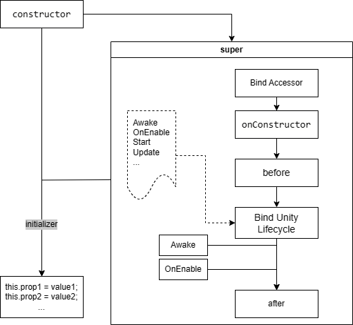

*The current page is translated by a machine, information may be missing or inaccurate. If you encounter any problems or have questions, please submit an ISSUE.*

## Introduction
> You only need to inherit [xor.TsBehaviour](../../projects/TsEditorProject/src/xor/components/behaviour.ts) to use Unity's [lifecycle](https://docs.unity3d.com/2021.3/Documentation/Manual/ExecutionOrder.html) methods. You need to pass the [UnityEngine.GameObject](https://docs.unity3d.com/ScriptReference/GameObject.html) object as a parameter when calling the constructor;  
> 
> If you need to mount a TypeScript script and serialize its members, please refer to the [[TsComponent]](./TsComponent.md) module.

## Definition
> [`C#`] Inherits: [XOR.TsBehaviour](../../projects/Assets/XOR/Runtime/Src/Components/TsBehaviour/TsBehaviour.cs) → [UnityEngine.MonoBehaviour](https://docs.unity3d.com/ScriptReference/MonoBehaviour.html)  

> [`ts`] Inherits: [xor.TsBehaviour](../../projects/TsEditorProject/src/xor/components/behaviour.ts) → None
<details>
<summary>Interface Details</summary>

| Member  | Description  |
| ------------ | ------------ |
| `get transform(): Transform` | Gets the UnityEngine.Transform component |
| `get gameObject(): GameObject` | Gets the UnityEngine.GameObject component |
| `get enabled(): boolean` |  |
| `set enabled(val: boolean): void` | Sets XOR.TsBehaviour.enable, affecting methods like Update, FixedUpdate, LateUpdate, etc. |
| `get isActiveAndEnabled(): boolean` |  |
| `get tag(): string` | Gets the tag of the GameObject component |
| `set tag(val: string): void` | Sets the tag of the GameObject component |
| `get name(): string` | Gets the name of the GameObject component |
| `set name(val: string): void` | Sets the name of the GameObject component |
| `get rectTransform(): RectTransform` |  |

| Method  | Description  |
| ------------ | ------------ |
| `StartCoroutine(Generator \| () => Generator): UnityEngine.Coroutine` | Starts a coroutine (preferably use Promise) |
| `StopCoroutine(UnityEngine.Coroutine): void` | Stops a coroutine |
| `StopAllCoroutines(): void` | Stops all coroutine instances |

| Decorators  | Description  |
| ------------ | ------------ |
| `@xor.TsBehaviour.standalone(): PropertyDecorator` | Calls as a standalone component (applicable to Update, LateUpdate, and FixedUpdate methods; by default, it uses BatchProxy to manage calls to meet higher performance requirements) |
| `@xor.TsBehaviour.frameskip(number): PropertyDecorator` | Calls across frames (globally shared/non-individual frameskip zone), conflicts with standalone components |
| `@xor.TsBehaviour.throttle(boolean): PropertyDecorator` | Applicable to async/Promise methods; will only be called again after the previous call is completed (Awake, Update, FixedUpdate, etc.) |
</details>

## Execution Order


## Simple Demonstration
> Example Scene: [projects/Assets/Samples/03_TsBehaviour](../../projects/Assets/Samples/03_TsBehaviour)  
> Example TypeScript Code: [projects/TsProject/src/samples/03_Behaviour.ts](../../projects/TsProject/src/samples/03_TsBehaviour.ts)  
```typescript
import GameObject = CS.UnityEngine.GameObject;
import Time = CS.UnityEngine.Time;

//Register global lifecycle callbacks to avoid creating multiple Delegate instances in xor.TsBehaviour
xor.TsBehaviour.setGlobalInvoker(true);

// A simple TsBehaviour example:
class Sample01 extends xor.TsBehaviour {
    private _time: number = 0;

    protected Awake(): void {
        console.log(`TsBehaviour ${Sample01.name}: Awake`);
    }
    // Update will be called uniformly by xor.TsBehaviour; you can use the `standalone` decorator to inform xor.TsBehaviour to use a separate Update call for the component
    //@xor.standalone()
    protected Update(deltaTime?: number): void {
        this._time += (deltaTime ?? Time.deltaTime);
        if (this._time > 1) {
            this._time -= 1;
            console.log(`TsBehaviour ${Sample01.name}: Update`);
        }
    }
    protected OnEnable(): void {
        console.log(`TsBehaviour ${Sample01.name}: OnEnable`);
    }
    protected OnDisable(): void {
        console.log(`TsBehaviour ${Sample01.name}: OnDisable`);
    }
}

export function init() {
    let gameObject = new GameObject(Sample01.name);
    return new Sample01(gameObject);
}
```
